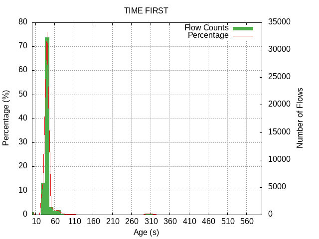

---
# Flow Age Stats module - README

## Description
This module is used for making statistics about the age of incoming flow data. The statistics produced are minimal, maximal and average values of the differences between the time a flow was received and its TIME_FIRST and TIME_LAST timestamps. 

Additionally the module can output two text files (0_time_first.txt, 0_time_last.txt) that each have a table of three columns. First is the max age of the flow (the end of bin range). Second is the percentage of flows that are in that age group. Third is the flow count. By default, the bins are 0-1s, 1s-10s, 10s-20s, ... 590s-600s, >600s. 

If -e is specified, the statistis are computed separately by reason why the flow is exported (i.e. the value of the FLOW_END_REASON field). In this case, the files are named "<reason>_time_{first/last}.txt", where <reason> is the value of the FLOW_END_REASON field (0-5).

Reference for FLOW_END_RESON values: https://www.iana.org/assignments/ipfix/ipfix.xhtml#ipfix-flow-end-reason

## Interfaces
- Input: One UniRec interface
    - Template MUST contain fields TIME_FIRST and TIME_LAST
- Output: None

## Parameters
- '-t'       If specified the module writes a file where the tables will be outputed. (Caution - the module will overwrite files labeled *_time_first.txt, *_time_last.txt)
- '-e'      'If specified the module creates statistics categorized based on FLOW_END_REASON.'

## Graphs
This module also comes with a script (graphs.sh) that makes use of GNUplot to make graphs from the data that is outputed into files. You can see how the graph looks like below.

